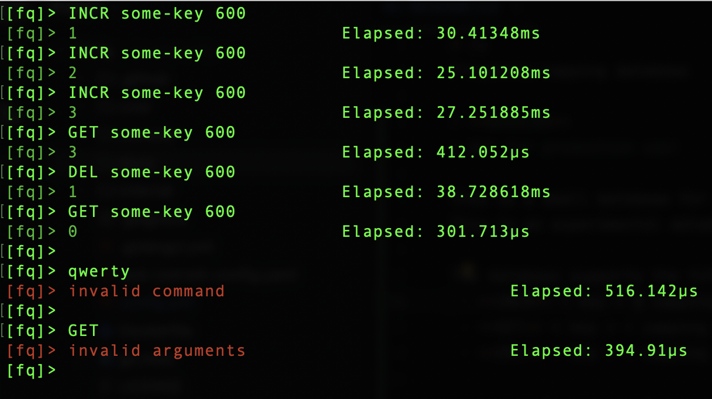

# fq
Frequency-capping database

> **WARNING**
> Not for production use!

This is a small database for the frequency-capping functionality.
This is an experimental database, you should not use it in production.

## Why?

To learn databases implementation.

## Commands

The database supports the following commands:
 - **INCR** < key > < capping > - Increment counter for a key
 - **GET** < key > < capping > - Get current counter value for a key
 - **DEL** < key > < capping > - Delete a key
 - **MDEL** < key > < capping > < key > < capping > < key > < capping > ... - Delete multiple keys
 - **WATCH** < key > < capping > - Watch for changes to a key's value (blocks until value changes or timeout)
 - **RLIMIT FW** < key > < limit > < window > - Fixed-window rate limit check and consume
 - **RLIMIT SW** < key > < limit > < window > - Sliding-window rate limit check and consume

< key > - is some string key for which you want to be able to increment the counter for a time interval of size < capping >.

### Rate Limiting

The **RLIMIT FW** command implements an atomic fixed-window rate limiter:

```shell
RLIMIT FW user_42 100 60
```

The response format is:

```text
ok|<allowed>;<current>;<remaining>;<reset_after>
```

- `allowed`: `1` when the request is allowed, `0` when it is rejected
- `current`: current counter value in the window
- `remaining`: requests left before the limit is reached
- `reset_after`: seconds until the current fixed window resets

Example with limit `3`:

```text
[fq]> RLIMIT FW user_42 3 60
1;1;2;44
[fq]> RLIMIT FW user_42 3 60
1;2;1;43
[fq]> RLIMIT FW user_42 3 60
1;3;0;42
[fq]> RLIMIT FW user_42 3 60
0;3;0;41
```

Only allowed requests are written to WAL as counter increments; rejected requests do not change state.

The **RLIMIT SW** command implements an atomic sliding-window rate limiter with the same response format:

```shell
RLIMIT SW user:42 100 60
```

It counts allowed events in the last `<window>` seconds. Only allowed requests are written to WAL as sliding-window events; rejected requests do not change state.

### WATCH Command

The **WATCH** command allows you to monitor a key for value changes. When executed, it:
- Blocks and waits for the key's value to change
- Polls the key every 100ms
- Returns the new value as soon as it changes
- Times out after 30 seconds if no changes are detected
- Can be cancelled with Ctrl+C

Example:
```
[fq]> WATCH mykey 600
Watching for changes... (press Ctrl+C to cancel)
[fq]> 5                    Elapsed: 1.234s
```

## Usage

### Building

Build binaries:
```shell
make build
```

This will create binaries in the `bin/` directory:
- `bin/fq` - database server
- `bin/fq-cli` - CLI client
- `bin/fq-bench` - benchmark client

### Running

#### Master Server

Run the master database server:
```shell
make run-server
```

Or directly:
```shell
go run ./cmd/fq
```

#### Slave Replica

Run a slave replica (in a separate terminal):
```shell
make run-slave
```

Or directly:
```shell
go run ./cmd/fq config-slave.yml
```

#### CLI Client

Connect to master (port :1945):
```shell
make run-cli
```

Or connect to slave (port :1947):
```shell
go run ./cmd/cli -address :1947
```

#### Benchmark Client

Run a live latency/RPS benchmark against master:
```shell
make run-bench
```

Example with 500 connections for 60 seconds:
```shell
go run ./cmd/bench -address :1945 -connections 500 -duration 60s -key_range 10000
```

Limit target load and customize generated keys:
```shell
go run ./cmd/bench -address :1945 -connections 200 -rps 50000 -key_range 100000 -batch 600
```

The benchmark screen updates once per second and shows current RPS, errors, latency percentiles, and terminal history charts. Use `-key_range` to control how many distinct keys are generated; smaller ranges create hotter keys and larger ranges spread writes across more keys.

### Example

1. Start master server:
   ```shell
   make run-server
   ```

2. Start slave replica (in another terminal):
   ```shell
   make run-slave
   ```

3. Connect CLI client to master:
   ```shell
   make run-cli
   ```

4. Execute commands:
   ```
   [fq]> INCR key 600
   1
   [fq]> INCR key 600
   2
   [fq]> WATCH key 600
   Watching for changes... (press Ctrl+C to cancel)
   [fq]> 3                    Elapsed: 0.567s
   ```

5. Connect CLI client to slave (in another terminal):
   ```shell
   go run ./cmd/cli -address :1947
   ```

6. Read replicated data:
   ```
   [fq]> GET key 600
   2
   ```

Example of using commands in CLI tool:



Also you can use GoLang client: [fq-client-go](https://github.com/rom8726/fq-client-go)

## Architecture

### Storage Layer

- **WAL (Write-Ahead Log)**: All write operations are logged to disk before being applied to the engine
- **Periodic Dumps**: Data is periodically dumped to disk for recovery and replication
- **In-Memory Engine**: Fast in-memory hash table for data storage

#### Persistence Modes

Persistence is controlled by `persistence.mode`:

```yaml
persistence:
  mode: wal_and_dump # wal_and_dump | dump_only | memory
```

- `wal_and_dump`: write operations are stored in WAL and periodic dumps are created
- `dump_only`: periodic dumps are created, but write operations are not stored in WAL
- `memory`: data is kept only in memory, without WAL or dumps

Current master-slave replication requires `wal_and_dump`, because it uses the initial dump plus continuous WAL segment replication.

#### WAL Commit Mode

`wal.sync_commit` controls when a write command is acknowledged:

```yaml
wal:
  sync_commit: off # on | off
```

- `on`: the command waits until its WAL batch is written and synced to disk before the response is sent. This gives stronger durability, but response latency includes WAL batching and disk sync time.
- `off`: the command is applied to the in-memory engine and acknowledged without waiting for WAL sync. WAL is still written in the background, but a crash can lose commands that were already acknowledged and not flushed yet.

For frequency capping workloads, `sync_commit: off` is usually the better default: losing a very small recent window of counters after a crash is often acceptable, while lower response latency and higher throughput matter more. Use `sync_commit: on` for commands or workloads that require stronger durability guarantees.

### Observability

Health and metrics endpoints are enabled when `observability.address` is set:

```yaml
observability:
  address: ":2112"
```

- `GET /healthz`: liveness check
- `GET /metrics`: Prometheus metrics

Available metrics include:

- `fq_tcp_active_connections`
- `fq_wal_queue_depth`
- `fq_wal_flush_duration_seconds`
- `fq_wal_flush_batch_records`
- `fq_wal_flush_total`
- `fq_replication_lag_lsn`
- `fq_replication_reconnect_total`
- `fq_replication_reconnect_attempts_total`
- `fq_replication_replica_last_applied_lsn{replica_id}`
- `fq_replication_replica_last_ack_timestamp{replica_id}`
- `fq_replication_known_replicas`

### Replication

The database supports **master-slave replication**:

- **Master**: Accepts write operations and replicates them to slaves
- **Slave**: Connects to master, synchronizes initial dump, and continuously replicates WAL segments

#### Replication Features

- **Initial Dump Synchronization**: Slave first synchronizes the complete database dump from master
- **WAL Replication**: After dump synchronization, slave continuously replicates WAL segments
- **Real-time Updates**: Slave receives updates from master with configurable sync interval (default: 1s)
- **Automatic Reconnection**: Slave automatically reconnects to master on network errors
- **Exponential Backoff**: Retry mechanism with exponential backoff for error handling
- **Session Management**: Master manages dump read sessions with TTL and cleanup

#### Configuration

Master configuration (`config.yml`):
```yaml
persistence:
  mode: wal_and_dump
replication:
  replica_type: master
  master_address: ":1946"  # Port for replication server
  sync_interval: 1s
```

Slave configuration (`config-slave.yml`):
```yaml
persistence:
  mode: wal_and_dump
replication:
  replica_type: slave
  replica_id: "replica-1"
  master_address: ":1946"  # Master replication address
  sync_interval: 1s
```

### Data Flow

1. **Write Operation**: Client sends write command to master
2. **WAL Write**: Master writes operation to WAL
3. **Engine Update**: Master applies operation to in-memory engine
4. **Replication**: Master sends WAL segment to slave (periodically)
5. **Slave Apply**: Slave receives WAL segment and applies to its engine

## Development

### Running Tests

```shell
make test
```

### Linting

```shell
make lint
```

### Building Protocol Buffers

```shell
make proto.wal.build
```
