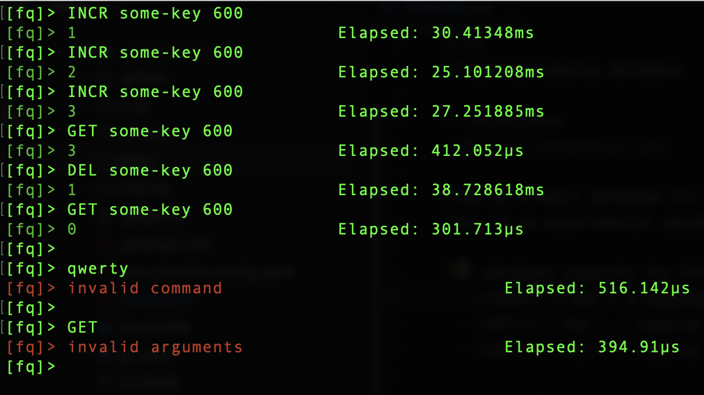

# fq
Frequency-capping database

> **WARNING**
> Not for production use!

> **WARNING**
> Replication in progress!

This is a small database for the frequency-capping functionality.
This is an experimental database, you should not use it in production.

## Commands

The database supports the following commands:
 - **INCR** < key > < capping >
 - **GET** < key > < capping >
 - **DEL** < key > < capping >
 - **MDEL** < key > < capping > < key > < capping > < key > < capping > ...

< key > - is some string key for which you want to be able to increment the counter for a time interval of size < capping >.

You can use CLI client:

```shell
$ go run cmd/cli/main.go -address :1945
```

Example of using commands in CLI tool:



Also you can use GoLang client: [fq-client-go](https://github.com/rom8726/fq-client-go)

## Architecture

Database uses WAL, periodically cleaning and dumping data to disk.

It's master-slave replication will be implemented in the future.
